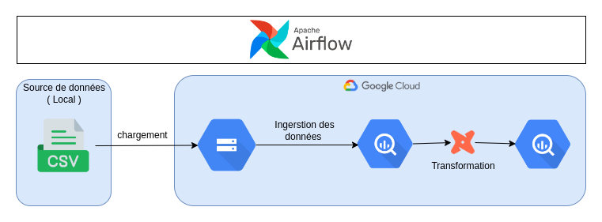
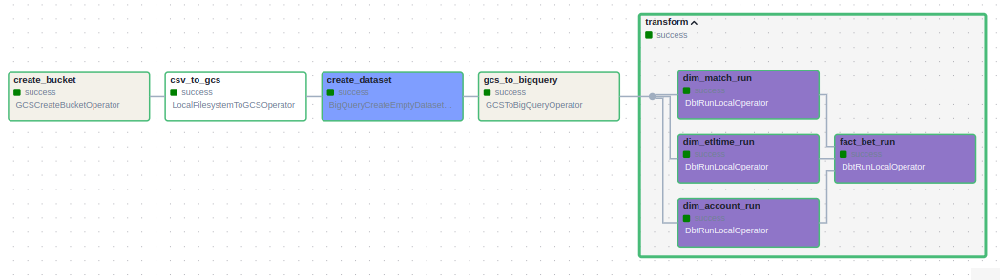
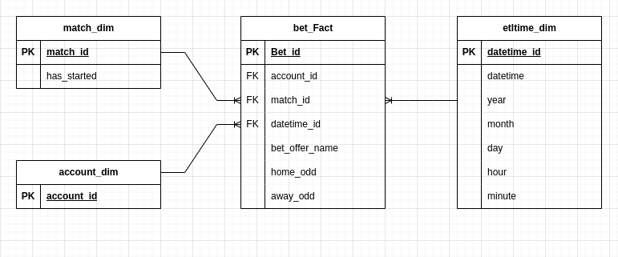

# Pipeline pour l'ingestion des données dans Bigquery

## description
Un projet dans lequel nous allons créer un pipeline de données ETL pour charger des données des matches dans des tournoie de tennis dans BigQuery en utilisant Airflow et DBT.

## Architecture de solution 

- Configurer l'environnement Airflow local avec Astro CLI.
- Créer un pipeline de données en utilisant Airflow.
- Charger des fichiers CSV dans Google Cloud Storage.
- Ingester les données dans BigQuery.
- Intégrer dbt pour exécuter des modèles de données avec Airflow.




### Pipeline sur airflow 


### Modelisation de données


### Outils utilisé 
- **Google Cloud Platform (GCP)**
  - Cloud Storage
  - BigQuery
- **Orchestration:** Apache Airflow
- **Transformation :** dbt

## Utilisation
#### 1. Cloner le repo:
D'abord, clonez le dépôt en utilisant HTTP :
```
git clone https://github.com/D2NM0/Tennis-matches-Test.git
```


#### 2. Configuration GCP:

1. Configurez le compte de service pour accéder à ce projet et téléchargez la clé d'authentification (.json). Veuillez vérifier que le compte de service dispose de toutes les autorisations suivantes :
    - Viewer
    - Administrateur de stockage (Storage Admin)
    - Administrateur d'objets de stockage (Storage Object Admin)
    - Administrateur BigQuery (BigQuery Admin)
2. Téléchargez le fichier JSON de la clé d'authentification et remplacez-le par le fichier service-account.json dans le chemin :
```
include/gcp/service-account.json
```
3. Téléchargez le SDK pour la configuration locale.

4. Activez les options suivantes dans la section API et services :
    - API de gestion des identités et des accès (IAM)
    - API des informations d'identification des comptes de service IAM


#### 4. Pipeline de Airflow 
1. Configurez vos identifiants Google Cloud Platform.
2. Créez et configurez les connexions nécessaires dans Airflow :
Dans l'interface utilisateur d'Airflow :
- Airflow → Admin → Connexions
    - id : gcp
    - type : Google Cloud
    - Chemin de la clé : /usr/local/airflow/include/gcp/sa.json
- Testez la connexion (Cliquez sur le bouton 'Test') → Sauvegardez (Cliquez sur le bouton 'Sauvegarder')
- Lancez le pipeline et surveillez son exécution.